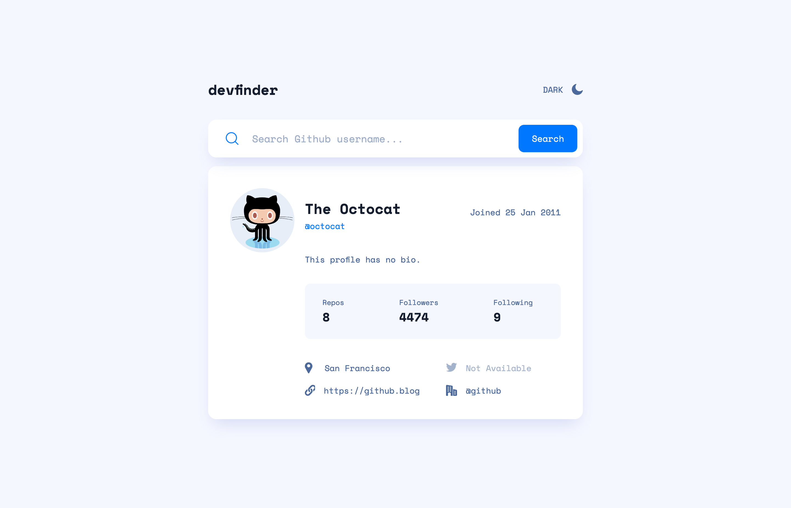
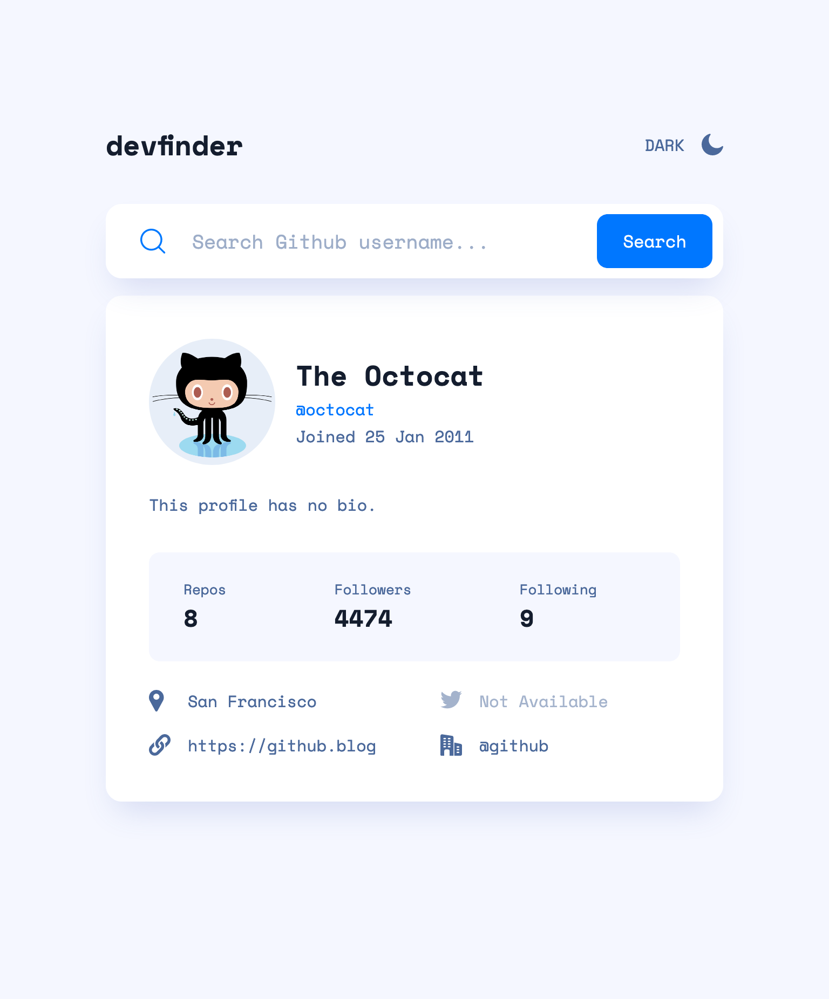
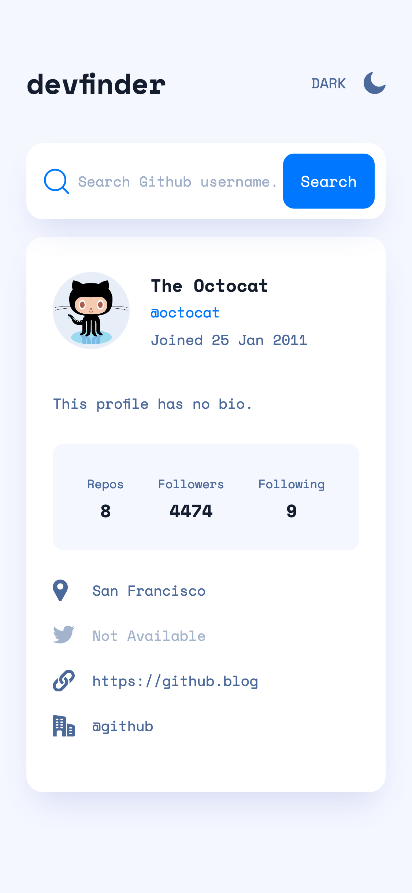

# Frontend Mentor - GitHub user search app solution

This is a solution to the [GitHub user search app challenge on Frontend Mentor](https://www.frontendmentor.io/challenges/github-user-search-app-Q09YOgaH6). Frontend Mentor challenges help you improve your coding skills by building realistic projects.

## Table of contents

- [Overview](#overview)
  - [The challenge](#the-challenge)
  - [Screenshot](#screenshot)
  - [Links](#links)
- [My process](#my-process)
  - [Built with](#built-with)
  - [What I learned](#what-i-learned)
- [Author](#author)
- [Acknowledgments](#acknowledgments)

## Overview

### The challenge

Users should be able to:

- View the optimal layout depending on their device's screen size
- See hover states for interactive elements
- Ui dark-mode should respond to users computer preferences

### Screenshot





### Links

- Solution URL: [Solution](https://www.frontendmentor.io/solutions/responsive-layout-mobile-1st-scss-flexbox-grids-vanilla-js-vite-9jpPGX-7X)

- Live Site URL: [Live Site](https://github-user-search-pied.vercel.app/)

## My process

### Built with

- [NextJs](https://nextjs.org/)
- [Styled Components](https://styled-components.com/)
- Flexbox
- CSS Grid
- Fetch API
- Mobile-first workflow

### What I learned

I learned how to work with the GitHub api. While working on this project I ran into a problem with GitHubs rate limit because I was not authenticating and I was only allowed to access the api only 60 times in an hour. In order to resolve this issue I had to learn how to authenticate by requesting a private GitHub token and then use that token key in the fetch api header.

```js
export async function getUserData(username) {
  try {
    //Get user profile
    const res = await fetch(`${URL}${username}`, {
      headers: {
        Authorization: `token ${TOKEN}`,
      },
    });

    // If username is not found, throw an error message
    if (!res.ok) throw new Error("No results");

    return await res.json();
  } catch (error) {
    throw error;
  }
}
```

## Author

- Website - [www.sergioswork.com](https://www.sergioswork.com)
- Frontend Mentor - [@sergioreynoso](https://www.frontendmentor.io/profile/sergioreynoso)
- LinkedIn - [@sreynoso](https://www.linkedin.com/in/sreynoso/)

## Acknowledgments

I would like to thank [Jonas Schmedtmann](https://codingheroes.io) for all his great [UDemy courses](https://www.udemy.com/user/jonasschmedtmann/), as well as [Kevin Powell](https://www.kevinpowell.co) for all the great css content and the whole [UI.dev](https://ui.dev/) community.
